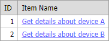

<!-- default badges list -->

[](https://supportcenter.devexpress.com/ticket/details/E308)
[](https://docs.devexpress.com/GeneralInformation/403183)
[](#does-this-example-address-your-development-requirementsobjectives)
<!-- default badges end -->

# Grid View for ASP.NET Web Forms - How to create and configure a HyperLink column at runtime


This example demonstrates how to create a grid column that displays hyperlinks.



Follow the steps below to create the HyperLink column at runtime.

1. Create an object of the [GridViewDataHyperLinkColumn](https://docs.devexpress.com/AspNet/DevExpress.Web.GridViewDataHyperLinkColumn) type.
2. Use the object's [PropertiesHyperLinkEdit](https://docs.devexpress.com/AspNet/DevExpress.Web.GridViewDataHyperLinkColumn.PropertiesHyperLinkEdit) property to customize the hyperlink-related settings.
3. Call the [Add](https://docs.devexpress.com/AspNet/DevExpress.Web.GridViewColumnCollection.Add(DevExpress.Web.GridViewColumn)) or [Insert](https://docs.devexpress.com/AspNet/DevExpress.Web.GridViewColumnCollection.Insert(System.Int32-DevExpress.Web.GridViewColumn)) method to add the newly created column to the grid column collection.

```cs
public void PopulateColumns() {
    // ...
    GridViewDataHyperLinkColumn colItemName = new GridViewDataHyperLinkColumn();
    colItemName.FieldName = "ItemName";
    colItemName.PropertiesHyperLinkEdit.NavigateUrlFormatString = "~/details.aspx?Device={0}";
    colItemName.PropertiesHyperLinkEdit.TextFormatString = "Get details about device {0}";
    colItemName.PropertiesHyperLinkEdit.TextField = "ItemName";
    ASPxGridView1.Columns.Add(colItemName);
}
```

Columns are created on the first Page_Init event call. Then, the grid automatically recreates columns from the view state on a callback or post back.

```cs
protected void Page_Init(object sender, EventArgs e) {
    ASPxGridView1.KeyFieldName = "ID";
    ASPxGridView1.DataSource = GetData();
    if (!IsPostBack && !IsCallback) {
        PopulateColumns();
        ASPxGridView1.DataBind();
    }
}
```

## Files to Review

* [Default.aspx.cs](./CS/Default.aspx.cs#L40-L45) (VB: [Default.aspx.vb](./VB/Default.aspx.vb))
* [Default.aspx](./CS/Default.aspx) (VB: [Default.aspx](./VB/Default.aspx))
<!-- feedback -->
## Does this example address your development requirements/objectives?

[](https://www.devexpress.com/support/examples/survey.xml?utm_source=github&utm_campaign=asp-net-web-forms-grid-create-hyperlink-column-at-runtime&~~~was_helpful=yes) [](https://www.devexpress.com/support/examples/survey.xml?utm_source=github&utm_campaign=asp-net-web-forms-grid-create-hyperlink-column-at-runtime&~~~was_helpful=no)

(you will be redirected to DevExpress.com to submit your response)
<!-- feedback end -->
